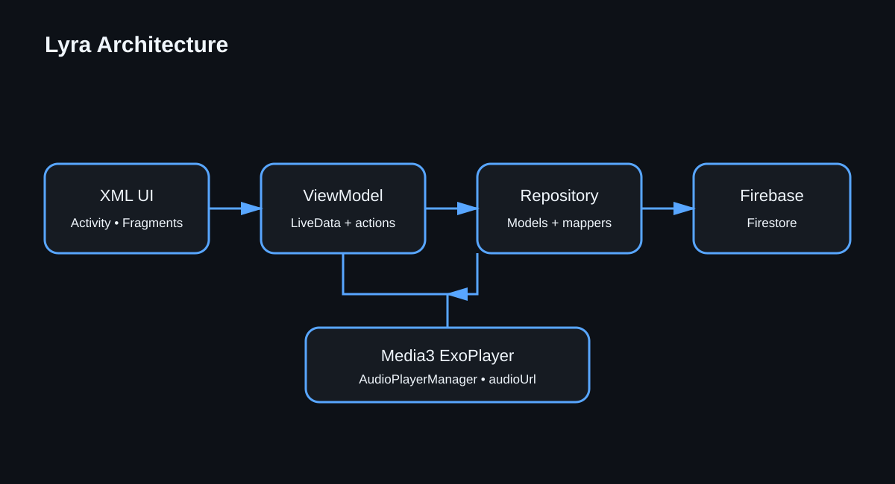

# Lyra

Lyra là một ứng dụng nghe nhạc Android hiện đại, được xây dựng bằng Kotlin và Jetpack Compose. Ứng dụng kết hợp giao diện tối giản với dữ liệu được quản lý qua Firebase và trình phát Media3, giúp người dùng khám phá bài hát, tìm kiếm thư viện nhạc và điều khiển phát nhạc trong một trải nghiệm tập trung.

> Dự án đang được phát triển. Một số màn hình và phần cài đặt hiện mới tập trung vào giao diện, các chức năng lưu trữ và tài khoản sẽ tiếp tục được hoàn thiện.

## Tính năng

- Màn hình Khám phá với bài hát nổi bật, bài hát phổ biến, ảnh bìa và mini-player.
- Tìm kiếm bài hát theo tên bài hát hoặc nghệ sĩ.
- Màn hình Đang phát với:
  - phát và tạm dừng;
  - chuyển bài trước và bài tiếp theo;
  - thanh tiến trình và tua bài hát;
  - vuốt để chuyển bài;
  - xử lý trạng thái buffering và phát nhạc.
- Màn hình Yêu thích và Tải xuống để tổ chức các bài hát trong ứng dụng.
- Màn hình Cài đặt với thông tin người dùng và các tùy chọn phát nhạc được tải từ Firebase.
- Tải ảnh bìa từ mạng bằng Coil, kèm ảnh thay thế khi tải thất bại.
- Tích hợp Firebase Firestore cho dữ liệu bài hát và người dùng.
- Tích hợp Media3 ExoPlayer để phát các URL âm thanh.

## Công nghệ sử dụng

- Kotlin 2.2.21
- Android Gradle Plugin 9.1.1
- Jetpack Compose và Material 3
- AndroidX Navigation Compose
- AndroidX Lifecycle ViewModel và Compose Runtime
- AndroidX Media3 ExoPlayer và Media3 UI
- Firebase Firestore và Firebase Storage
- Coil 3 để tải ảnh
- Kotlin Coroutines
- JUnit và kotlinx-coroutines-test

## Kiến trúc

Lyra sử dụng kiến trúc MVVM kết hợp Repository:

```text
app/src/main/java/com/devpro/sound/
├── data/
│   ├── mapper/              # Chuyển đổi dữ liệu giữa các tầng
│   ├── model/               # Model nghiệp vụ như Song và User
│   ├── remote/              # Data source và DTO của Firestore
│   ├── repository/          # Interface của repository
│   └── repositoryImpl/      # Các triển khai repository
├── player/                  # Quản lý Media3/ExoPlayer
└── ui/
    ├── components/          # Component Compose dùng chung
    ├── discover/
    ├── downloads/
    ├── favorites/
    ├── navigation/
    ├── nowplaying/
    ├── search/
    └── settings/
```

Luồng dữ liệu chính:

```text
Firestore → RemoteDataSource → Repository → ViewModel → Compose UI
                                                   ↓
                                             Media3 ExoPlayer
```

## Đặc tả use case và sơ đồ quan hệ

- [Đặc tả use case](docs/use-cases.md)
- [Mã nguồn sơ đồ quan hệ](docs/diagrams/lyra-architecture.dot)



## Yêu cầu môi trường

- Android Studio có Android SDK 37.
- JDK 11.
- Một Firebase project đã đăng ký ứng dụng Android với application ID `com.devpro.sound`.
- Thiết bị hoặc emulator chạy Android 7.0 (API 24) trở lên.

## Cài đặt

1. Clone repository:

   ```bash
   git clone https://github.com/huanminh254/Lyra.git
   cd Lyra
   ```

2. Mở dự án bằng Android Studio và chờ Gradle đồng bộ.

3. Tạo hoặc chọn một Firebase project, đăng ký ứng dụng Android với package name `com.devpro.sound`, sau đó tải file `google-services.json`.

4. Đặt file vào vị trí:

   ```text
   app/google-services.json
   ```

   File này được Git bỏ qua vì phụ thuộc vào môi trường Firebase. Bạn vẫn cần cấu hình đúng Firebase Security Rules cho Firestore và Storage.

5. Tạo các collection Firestore theo phần hướng dẫn bên dưới, sau đó chạy cấu hình `app` trên emulator hoặc thiết bị Android đã kết nối.

## Cấu trúc dữ liệu Firestore

### Collection `songs`

Lyra đọc bài hát từ collection `songs` và sắp xếp theo trường số `sortOrder`. Một document có thể chứa:

```json
{
  "title": "Example Song",
  "artist": "Example Artist",
  "currentTime": "00:00",
  "duration": "03:42",
  "audioUrl": "https://example.com/audio.mp3",
  "coverUrl": "https://example.com/cover.jpg",
  "audioObjectPath": "audio/example-song.mp3",
  "coverObjectPath": "covers/example-song.jpg",
  "originalFileName": "example-song.mp3",
  "sizeBytes": 1234567,
  "sortOrder": 1,
  "sourceUrl": "https://example.com/source",
  "genre": "V-Pop",
  "year": "2026"
}
```

`audioUrl` phải là URL có thể phát bằng Media3. `coverUrl` được dùng bởi Coil để hiển thị ảnh bìa.

### Collection `users`

Phiên bản hiện tại mặc định đọc document `user_001`:

```json
{
  "name": "Lyra Listener",
  "accountSubtitle": "Music lover",
  "audioQuality": "High",
  "streamOnlyOnWifi": false,
  "darkModeEnabled": true,
  "cacheSubtitle": "0 MB used",
  "appVersion": "1.0"
}
```

## Build và kiểm thử

Build APK debug:

```bash
./gradlew assembleDebug
```

Chạy unit test:

```bash
./gradlew test
```

Chạy instrumented test trên thiết bị hoặc emulator:

```bash
./gradlew connectedAndroidTest
```

## Trạng thái dự án

Các luồng khám phá, tìm kiếm, tải dữ liệu bài hát từ xa và phát nhạc đã được triển khai. Chức năng yêu thích, tải xuống, xác thực người dùng và lưu tùy chọn cài đặt vẫn đang nằm trong lộ trình phát triển.

## Media và bản quyền

Repository không bao gồm các thư mục audio hoặc ảnh bìa được chuẩn bị cục bộ để upload. Chỉ sử dụng media do bạn sở hữu hoặc có giấy phép phân phối. Hãy kiểm tra điều khoản bản quyền và phân phối của mọi nguồn bên ngoài trước khi đưa nội dung lên Firebase Storage hoặc phát hành ứng dụng.

Copyright © 2026 Nguyen Minh Huan. Mã nguồn, tài liệu và cấu hình riêng của dự án thuộc về tác giả, trừ khi có ghi chú khác. Nội dung audio, ảnh bìa và tài nguyên bên thứ ba thuộc về chủ sở hữu tương ứng.

## Đóng góp

Mọi đóng góp đều được chào đón. Trước khi tạo pull request:

1. Tạo một branch riêng từ `main`.
2. Tách riêng các thay đổi về giao diện, dữ liệu và trình phát khi có thể.
3. Thêm hoặc cập nhật test cho các thay đổi về hành vi.
4. Chạy `./gradlew test` và kiểm tra ứng dụng trên emulator hoặc thiết bị thật.
5. Mô tả thay đổi hướng đến người dùng và các thay đổi schema Firebase trong pull request.

Nếu muốn đề xuất ý tưởng, báo lỗi hoặc gửi đóng góp, vui lòng mở issue/pull request hoặc liên hệ [minhhuan110702@gmail.com](mailto:minhhuan110702@gmail.com).

## Giấy phép

Dự án hiện chưa chọn giấy phép mã nguồn mở. Cho đến khi có license chính thức, mọi quyền được bảo lưu bởi chủ sở hữu bản quyền.
